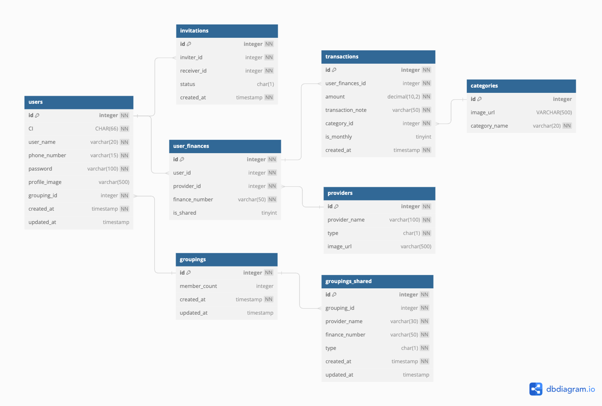
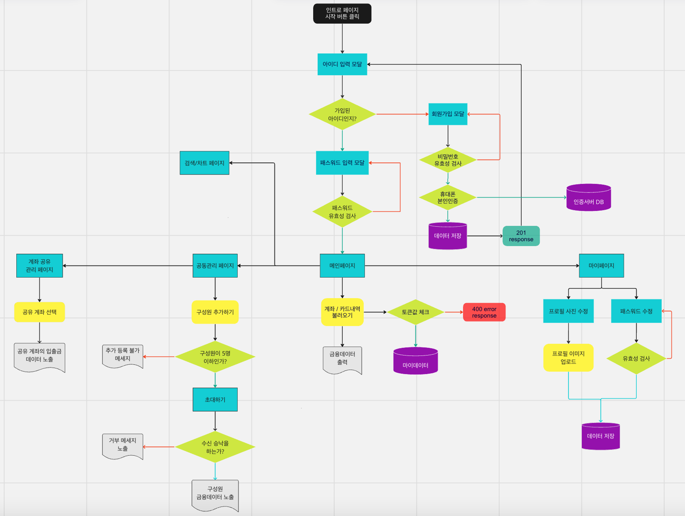

# 프로젝트 소개
공동 계좌의 관리 플랫폼

## ▶️시연 영상

## ⏰개발 기간

- 2023/09/04 ~ 2023/09/22

<h2>🔧기술 스택</h2>

 

FRONTEND

 
 
 

 

BACKEND

  
   
  

 

CO-OP TOOLS

  
  
  
  
  
  
  

## ERD

## User Flow Chart

## 📌구현 기능

### 1. 회원 관리
- 회원가입: 전화번호 본인인증, 이름과 패스워드 입력
- 로그인: 사용자 정보를 토큰에 담아 전달
- 패스워드 변경: 기존 패스워드 확인 후 새 패스워드로 변경
- 프로필 이미지 변경: AWS S3를 활용한 이미지 업로드 및 URL 저장

### 2. 메인 페이지
- 사용자 대시보드 표시
- 연결된 카드 및 은행 계좌 정보 요약

### 3. 카드/은행 관리
- 카드/은행 선택 화면
- 카드/은행 추가하기
- 카드/은행 삭제하기

### 4. 마이데이터 연동
- 마이데이터 계좌 데이터 조회
- 마이데이터 금융 조회
- 본인인증 데이터 조회

### 5. 공동 계좌 관리
- 공동관리 메인 페이지
- 공동관리 계좌 상세 정보
- 구성원 추가
- 그룹 연결 해지
- 구성원 리스트 조회
- 공유계좌 카드 리스트
- 계좌/카드 공유 설정 및 해지

### 6. 거래 내역 및 통계
- 년월별 수입/지출 수치화
- 월별 거래 내역 조회
- 메인 화면 거래 내역 요약

### 7. 보안 및 인증
- 본인인증 프로세스
- 토큰 기반 인증 시스템

이 프로젝트는 사용자들이 개인 및 공동 계좌를 효율적으로 관리할 수 있도록 다양한 기능을 제공합니다. 금융 데이터의 통합 조회, 공동 계좌 관리, 그리고 직관적인 거래 내역 분석 등을 통해 사용자들의 재무 관리를 돕습니다.
